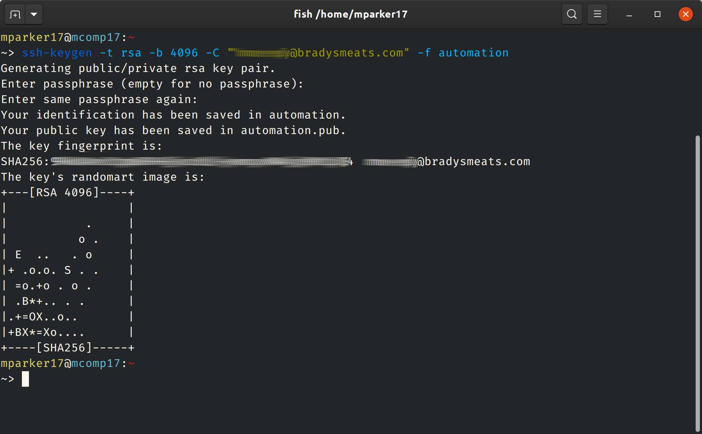
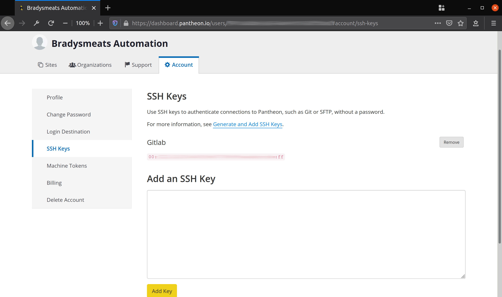
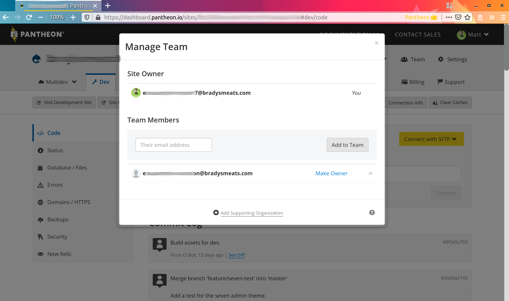
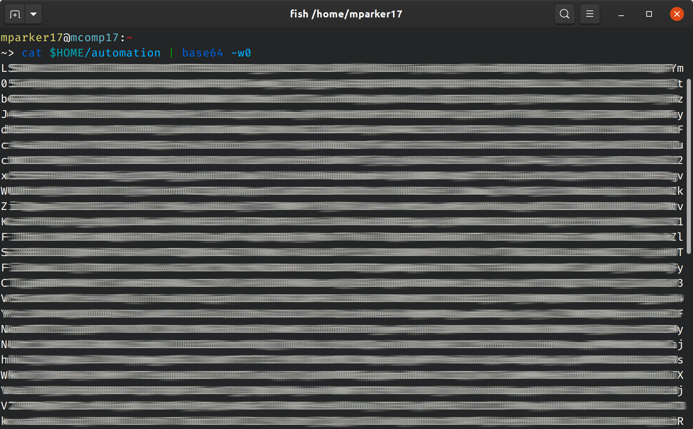
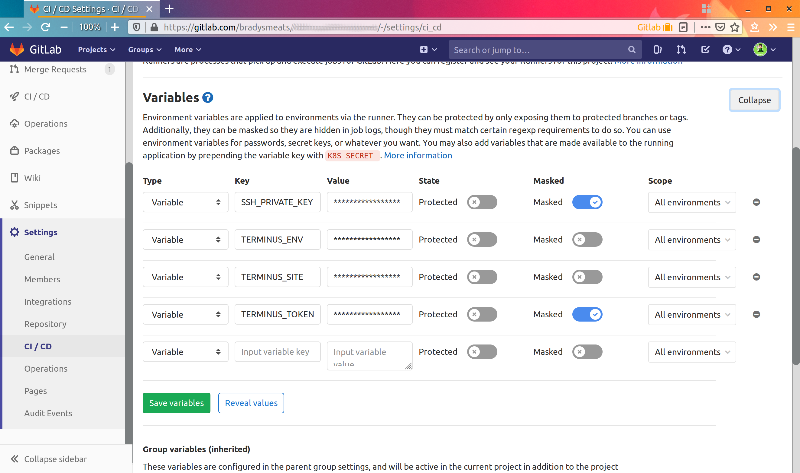
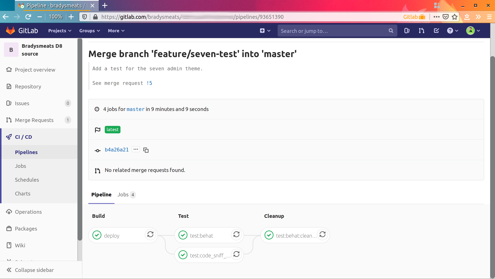
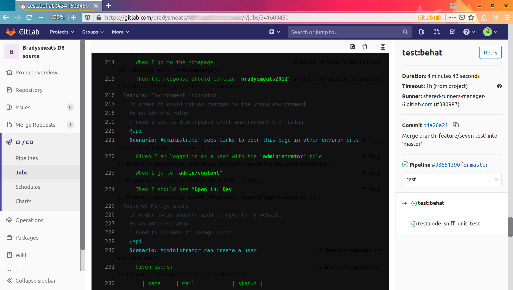

<section>

# Automated Behavioral Testing on a budget with Pantheon, GitLab CI, and Behat
— with [mparker17][mparker17-drupalorg]

<small>Follow along at [mparker17.github.io/talk--software-testing-overview](index.md)</small>

[mparker17-drupalorg]: https://www.drupal.org/u/mparker17

</section>

<!-- Introduction -->

<section>

## Who am I?

[mparker17][mparker17-drupalorg] on Drupal.org, [GitHub][mparker17-github], and [GitLab][mparker17-gitlab]

I work for [Digital Echidna][echidna], [Brady's Meat & Deli][bradysmeats]

<small>(previously [Environment Canada][wsc], [Versabanq][versabanq], [UWaterloo][uwaterloo], [PeaceWorks][peaceworks], [Myplanet][myplanet], [OpenConcept][openconcept])</small>

I am an [Acquia Certified Drupal Developer][acquia-cert]

<small><abbr title="Computer Science">CS</abbr> degree not completed at UWaterloo</small>

[mparker17-github]: https://github.com/mparker17
[mparker17-gitlab]: https://gitlab.com/mparker17
[echidna]: https://echidna.ca
[bradysmeats]: https://bradysmeats.com
[wsc]: https://www.canada.ca/en/environment-climate-change/services/water-overview/quantity/monitoring/survey.html
[versabanq]: https://www.versabank.com
[uwaterloo]: https://uwaterloo.ca
[peaceworks]: https://peaceworks.ca
[myplanet]: https://www.myplanet.com
[openconcept]: https://openconcept.ca
[acquia-cert]: https://certification.acquia.com/user/843258

</section>

<!-- Why. -->

<section>
<section>

## How did this all start?

1. Bradys is using Pantheon for our existing D7 site; but we are porting our site to D8
2. We needed to install [Drupal Commerce][drupal-commerce]
    * Drupal Commerce has non-Drupal dependencies, so it needs Composer
    * Using Composer on Pantheon breaks automatic updates — and isn't encouraged

[drupal-commerce]: http://drupal.org/project/commerce

</section>
<section>

### How did this all start? (ctd.)

3. Researched other hosting providers ([Acquia Cloud][acquia-cloud], [Platform.sh][platformsh-pricing], [Omega8.cc][omega8-pricing], [Contegix][contegix-drupal])
    * ... for our use case, [Pantheon][pantheon-pricing] is still cheaper by large margin
4. Reading support pages and forums pointed me to [`pantheon-systems/example-drops-8-composer`][example-drops-8-composer]
    * it didn't solve the broken automatic updates;
    * but it is a recommended way of adding creating a site with composer dependencies

[example-drops-8-composer]: https://github.com/pantheon-systems/example-drops-8-composer/
[acquia-cloud]: https://www.acquia.com/products-services/acquia-cloud
[platformsh-pricing]: https://platform.sh/pricing/
[omega8-pricing]: https://omega8.cc/pricing
[contegix-drupal]: https://www.contegix.com/drupal
[pantheon-pricing]: https://pantheon.io/plans/pricing

</section>
<section>

## Why Pantheon?

1. I'm the only developer at Brady's — and I'm not a ops security expert
2. Maintaining our own server would take too much time
3. Specialized Drupal hosting (in general) has key features:
    * Drupal-tuned application firewall,
    * strong control over code,
    * automated backups,
    * automated error collection and logging.

</section>
<section>

## Why Pantheon? (ctd.)

4. Pantheon (in particular) saves me time:
    * competitive price;
    * zero-config+free: HTTPS, traffic scaling, <abbr title="Content Distribution Network">CDN</abbr>, advanced caching, server-side metrics collection;
    * Canadian data residency;
    * automated status checks.
    * (automatic core updates; but we are no longer using this feature)

</section>
<section>

## Why GitLab CI?

1. Simple pricing scheme ([max 2000 minutes/month][gitlab-pricing], versus [buying "credits"][circleci-pricing] or [max number of users][bitbucket-pricing]),
2. Useful, clear metrics — cycle time, CI job time,
3. Easy to set up a self-hosted Community Edition instance,
4. Other open-source projects that I use have started using it ([Drupal.org][drupal-gitlab], [GNOME][gnome-gitlab], [LineageOS][lineage-gitlab], etc.).

[gitlab-pricing]: https://about.gitlab.com/pricing/
[circleci-pricing]: https://circleci.com/pricing/
[bitbucket-pricing]: https://bitbucket.org/product/pricing
[gitlab-ce]: https://about.gitlab.com/install/
[drupal-gitlab]: https://git.drupalcode.org
[gnome-gitlab]: https://gitlab.gnome.org
[lineage-gitlab]: https://gitlab.com/LineageOS

</section>
<section>

## Why Behat?

1. We mainly need a way to test for regressions,
2. Very little custom code on the Bradys site — all behavior in config,
3. Working configuration already in template Pantheon repo,
4. Specify behavior with industry-standard [Gherkin][gherkin] <abbr title="Domain Specific Language">DSL</abbr>.

[gherkin]: https://cucumber.io/docs/gherkin/reference/

</section>
</section>

<!-- Artifact repos -->

<section>
<section>

## Concept: artifact repos

<div class="fragment fade-in-then-semi-out">

1. PHP is an interpreted language: its source code is the program — "traditional" languages are compiled to "artifacts", which get distributed/run.

</div>
<div class="fragment fade-in-then-semi-out">

2. Before D8, Drupal was in its own world: nearly everything in modules or themes
    * (sometimes you needed libraries — usually front-end scripts — and PHP libraries were a special case)

</div>
<div class="fragment fade-in-then-semi-out">

3. This meant you could use the same Git repo to:
    * version control your source code,
    * manage the state of your production filesystem.

</div>

</section>
<section>

### Concept: artifact repos (ctd.)

4. With D8, we made a conscious decision to build on work outside Drupal community:
    * this lets us accomplish more than if we did everything ourselves...
    * <span class="fragment">but... we have to deal with Composer (which compiles dependencies);</span>
    * <span class="fragment">and... modern theming practices often involves compiling assets.</span>

<div class="fragment">

5. So now web dev has become more like "traditional" development <br />(i.e.: we have to compile before we can run)

</div>
</section>
<section>

### Concept: artifact repos (ctd.)

6. Git treats artfacts like any other file
    * this is great if you're using Git to manage the state of a filesystem,
    * but if you're doing that, it makes development difficult (lot of noise/churn)

</section>
<section>

### Concept: artifact repos (ctd.)

One possible solution:

1. tell your VCS to ignore artifacts,
2. do your development as normal
3. deploy the repo to production
4. compile your dependencies, assets, etc. on production

</section>
<section>

### Concept: artifact repos (ctd.)

This has problems, though...

* <span class="fragment fade-in-then-semi-out"> **reproducability** — composer/npm *can and will* download different versions of packages on different runs</span>
* <span class="fragment fade-in-then-semi-out"> **disaster recovery** — what if package server is down? what if you want to spin up a replacement server?</span>
* <span class="fragment fade-in-then-semi-out"> **security** — how do you detect unauthorized changes? what if your prod server has limited outbound internet access for security?</span>
* <span class="fragment fade-in-then-semi-out"> **scalability** — what if you want to spin up a load-balancer running identical code?</span>

</section>
<section>

### Concept: artifact repos (ctd.)

* A better solution:
    1. store your code in a "source" repo without compiled dependencies,
    2. use Continuous Integration (CI) to compile your dependencies, and package that into an "artifact repo"
    3. deploy your artifact repo

<div class="fragment">

* The **artifact repo** gives you the reproducability, disaster recovery, security, and scalaiblity you need
* The **source repo** makes development / code review easier

</div>

</section>
</section>

<!-- Setup -->

<section>
<section>

## Set up source repo

[`pantheon-systems/example-drops-8-composer`][example-drops-8-composer] is a source repo template

1. But it had a lot of stuff in it that I didn't need (provisioning scripts, CircleCI code, etc.)
2. And I wanted to understand it
3. So I started by deleting all the stuff I didn't need
    * Got it down to 32 files and 1200 lines of code (excluding `composer.lock`)

</section>
<section>

## Set up automation bot

The automation bot needs to push code to Pantheon...

1. Create the bot an email account
2. Generate an SSH key pair with `ssh-keygen -f $destination_file`
    * Don't forget the `-f $destination_file`!
    * Don't set a password because GitLab CI can't enter it
3. Sign up bot for Pantheon user account; add SSH public key; generate machine token
4. Grant the bot access to the site

</section>
<section>



</section>
<section>



</section>
<section>


</section>
<section>



</section>
<section>

## Setting up GitLab CI variables

The automation bot is going to push from GitLab...

1. Base64-encode the SSH private key with `cat $destination_file | base64 -w0`
2. Add information to the GitLab repo's Settings -> CI/CD -> Variables...
    * `SSH_PRIVATE_KEY` = the base64-encoded one
    * `TERMINUS_ENV` = `dev` (i.e.: the pantheon environment I want to run tests on)
    * `TERMINUS_SITE` = the machine name of the site
    * `TERMINUS_TOKEN` = the machine token

</section>
<section>



</section>
<section>



</section>
<section>

## GitLab CI Variable options

When entering variables, you'll see the following options...

* **Type** — can be variable or file — examples used vars
* **Protected** — whether variable is available during feature branch tests — maybe "no" on public sites?
* **Masked** — whether variable shows up in logs — "no" for keys/tokens
* **Scope** — lets you make multiple vars with same name, but different values per environment — useful if CI deploys to multiple environments

</section>
<section>

## Behat tests

`example-drops-8-composer` looks for tests in `tests/behat/features/`

For example:

```gherkin
# tests/behat/features/environment_indicator.feature
Feature: Environment indicator
In order to avoid making changes to the wrong environment
As an administrator
I need a way to distinguish which environment I am using

@api
Scenario: Administrator sees links to open this page in other environments
    Given I am logged in as a user with the "administrator" role
    When I go to "admin/content"
    Then I should see "Open in: Dev"
```

</section>
<section>

## End result

1. When I push to a branch, GitLab CI runs in two stages...
    1. **build** — compiles artifact repo, pushes with SFTP to Pantheon dev site
    2. **test** — spawns two sub-processes that run independently
        1. **test:behat** — runs Behat tests on the Pantheon dev site
        2. **test:code_sniff_unit_test** — runs `php -l`, `phpcs` with Drupal, DrupalPractice lints, `phpunit` on custom code

</section>
<section>



</section>
<section>



</section>
</section>

<!-- Limitations -->

<section>
<section>

## Limitation: no multidev

This setup mangles the dev environment, so only one person can test, and only one change at a time; and you can't really use the dev environment for anything else

* example-drops-8-composer was designed to be used with Pantheon multidev; but that's expensive
* this works for our use case though (1 dev, working local environment, hardly use dev, rarely use stage)


</section>
</section>

<!-- Conclusion. -->

<section>

## Thanks!

Special thanks to Rob and Monica at [Brady's Meat & Deli][bradysmeats]

</section>
